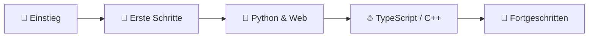

  

<h1 align="center">
  
</h1>

  
  
  

  
  
  

---

> [!NOTE]
> - Ich beschäftige mich leidenschaftlich mit Softwareentwicklung — vom Web-Frontend bis hin zu systemnahen Sprachen.

> [!TIP]
> - Als autodidaktischer Entwickler arbeite ich gerne an Projekten, die mich herausfordern und etwas Neues lehren.

<h3 align="center">
  
  GitHub Zahlen
  
</h3>

  
  
  

  
  
  

  
  

> 🌐 **webunics** — Mein Web-Projekt gebaut mit TypeScript

<h3 align="center">
  
  Werkzeuge die ich nutze
  
</h3>

| **Sprachen** | **Web** | **Arbeitsumgebung** |
|:---:|:---:|:---:|
| 

 | 

 | 

 |
| 

 | 

 | 

 |
| 

 | 

 | 

 |
| 

 | 

 | 

 |
| | 

 | |
| | 

 | |
| | 

 | |

<h3 align="center">
  
  Mein Weg als Entwickler
  
</h3>

<h3 align="center">
  
  Kontakt
  
</h3>

  
  

  

