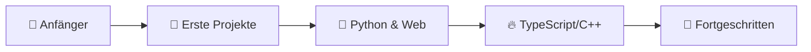

<p align="center">
  
</p>

<h1 align="center">
  
</h1>

<br />

<p align="center">
  
  
  
</p>

---

## 🧑‍💻 Über mich

```text
╭──────────────────────────────────────────────╮
│                                              │
│   ▸ Name        ▸ j1nx1e (webunics)          │
│   ▸ Rolle       ▸ Hobby-Entwickler           │
│   ▸ Standort    ▸ Deutschland 🇩🇪            │
│   ▸ Arbeitsplatz▸ Homeoffice 🏠              │
│   ▸ Leidenschaft▸ Code, der funktioniert     │
│                                              │
╰──────────────────────────────────────────────╯
```

> 💡 **Fun Fact:** Mein GitHub-Username hat mehr Einsen als Buchstaben — `fakej1nx1e` 🤓

---

## 🚀 Was ich gerade mache

| Projekt | Beschreibung | Tech |
|:---|:---|:---|
| 🐢 [**turtle**](https://github.com/fakej1nx1e/turtle) | Python-Projekt | Python |
| 📺 [**YTLite**](https://github.com/fakej1nx1e/YTLite) | YouTube Enhancer für iOS | Objective-C |
| 🌐 [**webunics**](https://github.com/fakej1nx1e/webunics) | Web-Projekt | TypeScript |

---

## 🛠️ Technologien mit denen ich arbeite

### Sprachen & Frameworks

<p align="center">
  
</p>

### Backend & Tools

<p align="center">
  
</p>

### Web-Grundlagen

<p align="center">
  
</p>

---

## 📈 GitHub Statistiken

<div align="center">

| 📊 Aktivität | 🏆 Top Sprachen |
|:---:|:---:|
|  |  |

| 🔥 Streak | 📅 Beitrags-Verlauf |
|:---:|:---:|
|  |  |

</div>

---

## 🐍 Contribution Snake

<p align="center">
  
</p>

---

## 🎯 Mein Weg als Entwickler



---

## 💬 So erreichst du mich

<p align="center">

| Kanal | Link |
|:---|:---|
| 🐙 **GitHub** | [github.com/fakej1nx1e](https://github.com/fakej1nx1e) |
| 📧 **Kontakt** | Schreib mir gerne eine Nachricht über GitHub |

</p>

---

## ✨ Besucher

<p align="center">
  
</p>

<br />

<p align="center">
  
</p>
